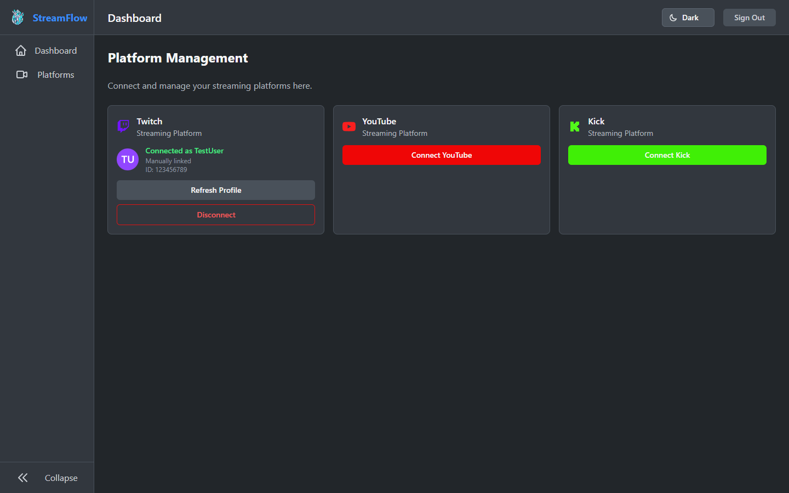
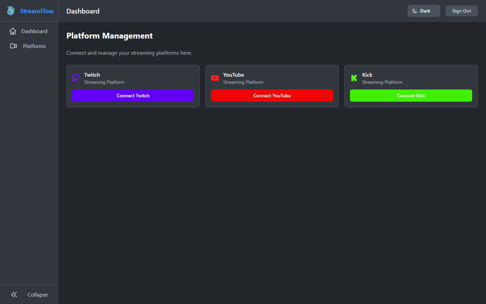
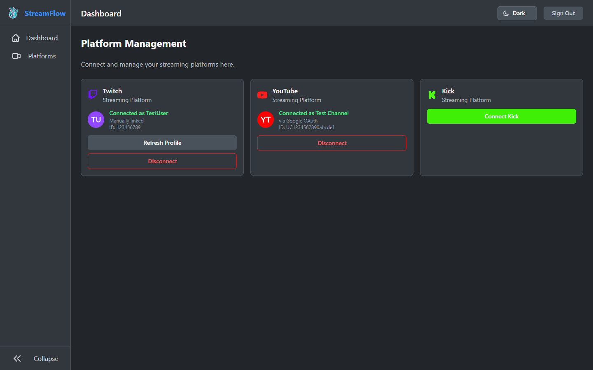
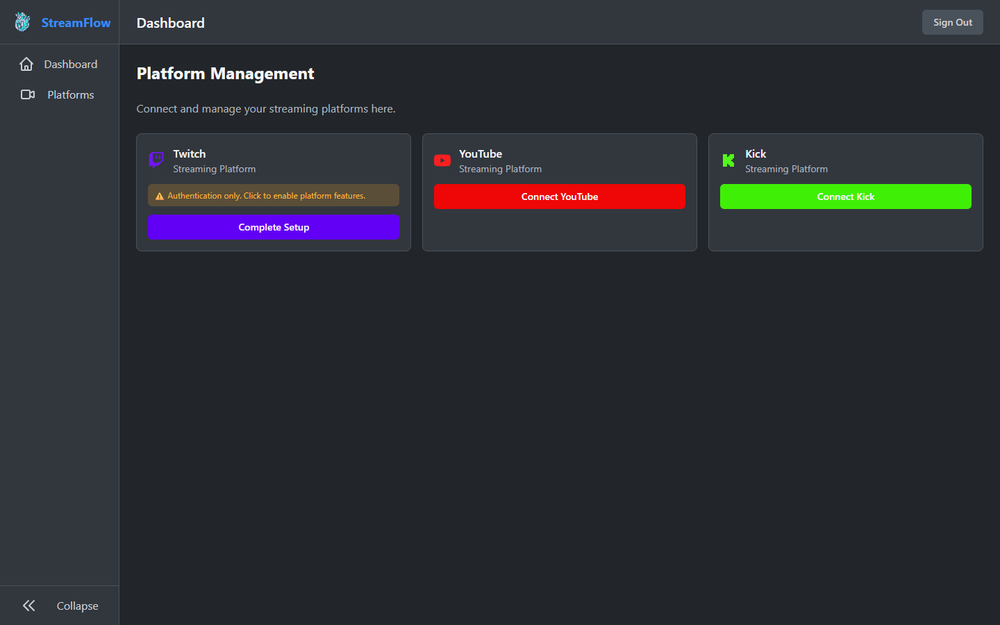
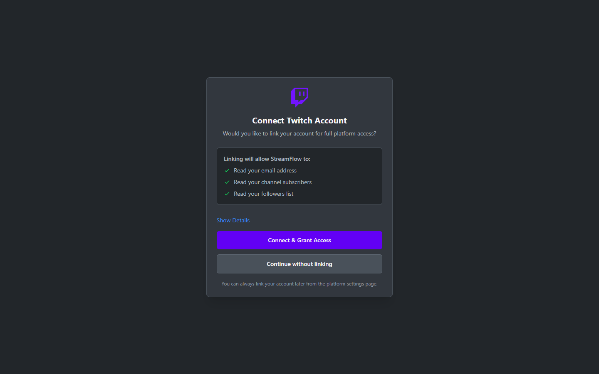
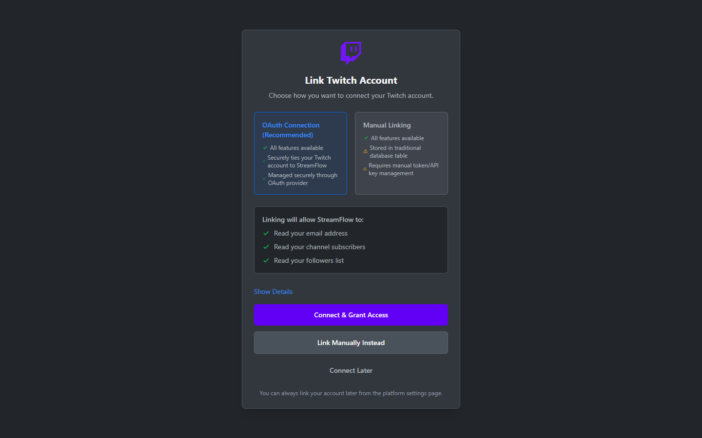
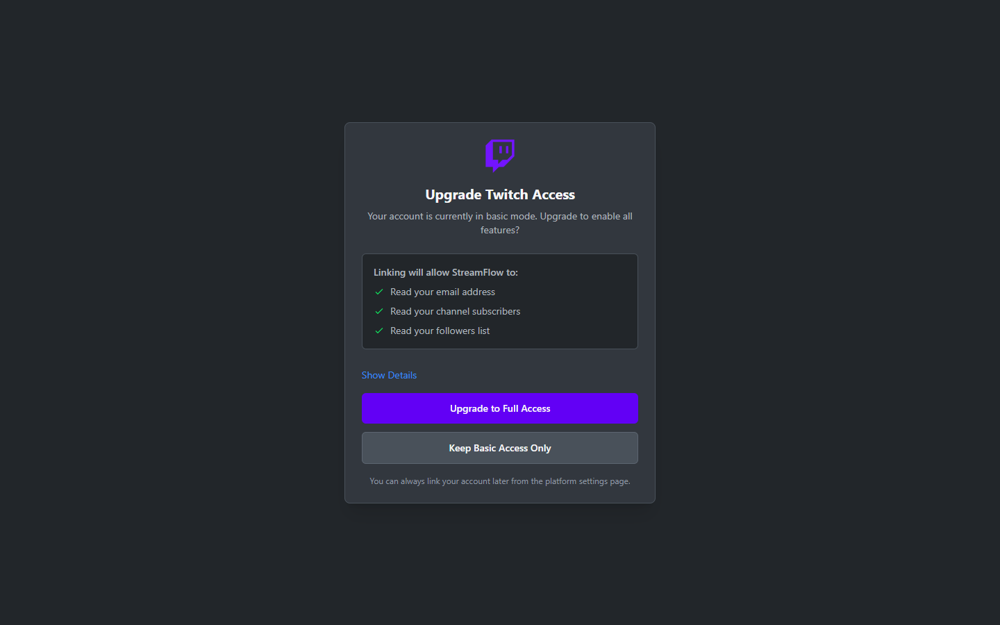

# 🌊 Aedron StreamFlow

<p align="center">
  <em>One dashboard to rule all your streams</em>
</p>

<p align="center">
  <a href="https://kit.svelte.dev" target="_blank">
    
  </a><!--
  --><a href="https://svelte.dev" target="_blank">
    
  </a><!--
  --><a href="https://www.typescriptlang.org" target="_blank">
    
  </a><!--
  --><a href="https://tailwindcss.com" target="_blank">
    
  </a>
</p>
<p align="center">
  <a href="https://supabase.com" target="_blank">
    
  </a><!--
  --><a href="https://bits-ui.com" target="_blank">
    
  </a><!--
  --><a href="https://github.com/aedrondouren/Aedron-StreamFlow/blob/supabase/LICENSE" target="_blank">
    
  </a>
</p>

## 📑 Table of Contents

| Section | Links |
|---------|-------|
| 🎯 Overview | [Features](#-features) • [Screenshots](#-screenshots) • [Platforms](#-supported-platforms) |
| 🛠️ Setup | [Tech Stack](#-tech-stack) • [Quick Start](#-quick-start) • [Prerequisites](#-prerequisites) |
| 📚 More | [Contributing](#-contributing) • [License](#-license) |

## ✨ Features

<table>
  <tr>
    <td align="center" width="60">🎮</td>
    <td><strong>Unified Controls</strong><br/>Sync titles, descriptions, and tags across all platforms instantly</td>
  </tr>
  <tr>
    <td align="center">💬</td>
    <td><strong>Unified Chat</strong><br/>View all platform chats in one place with smart filtering</td>
  </tr>
  <tr>
    <td align="center">🎨</td>
    <td><strong>Smart Overlays</strong><br/>Platform-specific views for recording software</td>
  </tr>
  <tr>
    <td align="center">⚡</td>
    <td><strong>Live Updates</strong><br/>Real-time sync across all your devices</td>
  </tr>
</table>

## 📸 Screenshots

> **Note:** Screenshots show the dark theme. The application supports light, dark, and system theme modes with automatic detection.

<p align="center">
  
  <br/>
  <em>Professional landing page showcasing features and supported platforms</em>
</p>

<p align="center">
  
  <br/>
  <em>Secure authentication with email and OAuth</em>
</p>

<p align="center">
  
  <br/>
  <em>Simple account creation with password confirmation</em>
</p>

<p align="center">
  
  <br/>
  <em>Unified dashboard with real-time streaming stats</em>
</p>

<p align="center">
  
  <br/>
  <em>Platform management with connected Twitch account</em>
</p>

<p align="center">
  
  <br/>
  <em>Platform management showing available platforms to connect</em>
</p>

<p align="center">
  
  <br/>
  <em>Multiple platforms connected with profile information</em>
</p>

<p align="center">
  
  <br/>
  <em>Platform showing managed_basic state with upgrade prompt</em>
</p>

<p align="center">
  
  <br/>
  <em>Initial OAuth prompt during signup with optional linking</em>
</p>

<p align="center">
  
  <br/>
  <em>Platform connection with OAuth vs Manual linking comparison</em>
</p>

<p align="center">
  
  <br/>
  <em>Upgrading from basic authentication to full platform access</em>
</p>

## 🎯 Supported Platforms

| Platform | Status   | Notes                                              |
| -------- | -------- | -------------------------------------------------- |
| Twitch   | ✅ Full  | Complete OAuth with managed & manual linking       |
| YouTube  | ⚡ OAuth | Google OAuth complete, API integration in progress |
| Kick     | 🚧 WIP   | OAuth/API integration in development               |

**Coming Soon:** TikTok Live, Instagram Live, X (Twitter) Spaces, YouTube Video & Shorts

## 💻 Tech Stack

- **⚡ SvelteKit 2** — Modern web framework with Svelte 5 runes
- **🔷 TypeScript** — Strict mode for type safety
- **🎨 Tailwind CSS v4** — Utility-first styling with custom theme variants
- **🧩 bits-ui** — Headless UI components for accessibility
- **🗄️ Supabase** — Auth, database, and realtime subscriptions
- **🌓 Theme System** — Light/dark/system themes with automatic system preference detection

## 🚀 Quick Start

```bash
# Clone the repository
git clone https://github.com/aedrondouren/Aedron-StreamFlow.git
cd Aedron-StreamFlow

# Install dependencies
pnpm install

# Setup environment
cp .env.example .env
# Edit .env with your Supabase credentials

# Start development server
pnpm dev
```

Open [http://localhost:5173](http://localhost:5173) and you're ready to go!

## 📋 Prerequisites

- **Node.js** 20+
- **pnpm** (`corepack enable`)
- **Supabase** project (local or hosted)

## 🤝 Contributing

We welcome contributions! Please see [CONTRIBUTING.md](CONTRIBUTING.md) for:

- Setup instructions
- Development workflow
- Code style guidelines
- Pull request process

## 📜 License

MIT © [Aedron](https://github.com/aedrondouren)

---

<p align="center">
  <em>Built with ❤️ for content creators</em>
</p>
