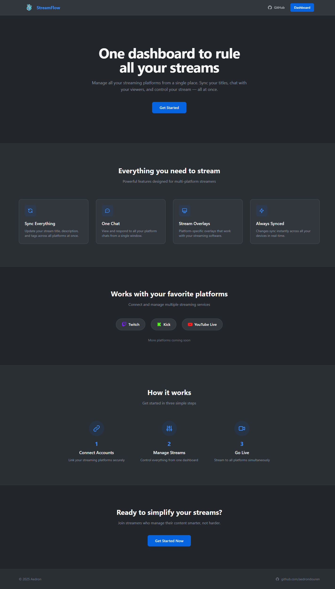
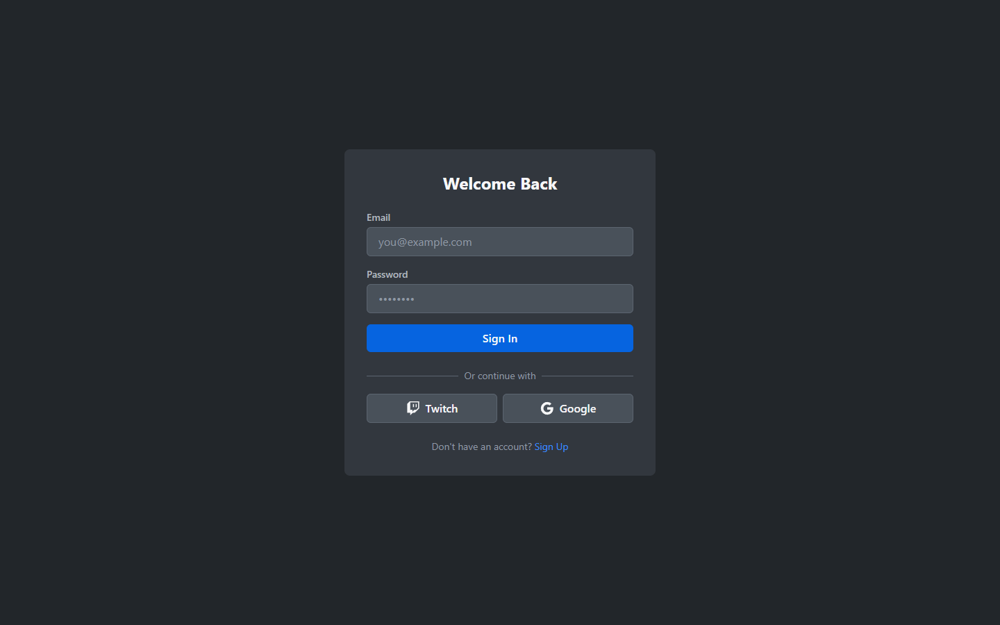
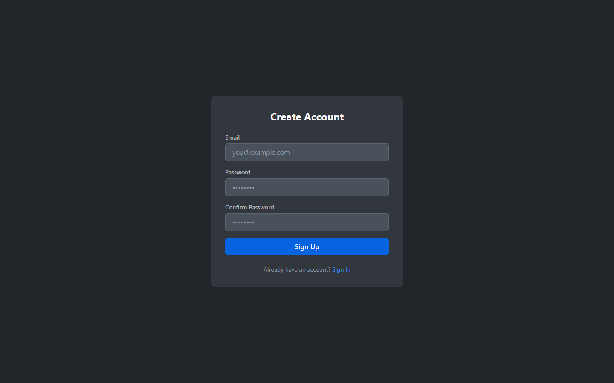
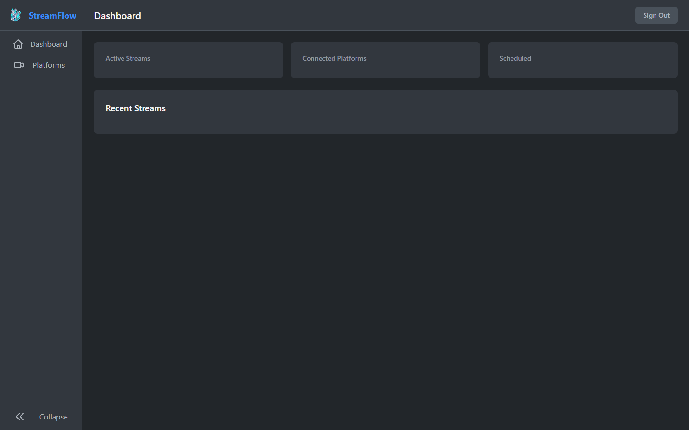

# 🌊 Aedron StreamFlow

<p align="center">
  <em>One dashboard to rule all your streams</em>
</p>

<p align="center">
  
  
  
  
  
  
</p>

---

## ✨ Features

<table>
  <tr>
    <td align="center" width="60">🎮</td>
    <td><strong>Unified Controls</strong><br/>Sync titles, descriptions, and tags across all platforms instantly</td>
  </tr>
  <tr>
    <td align="center">💬</td>
    <td><strong>Unified Chat</strong><br/>View all platform chats in one place with smart filtering</td>
  </tr>
  <tr>
    <td align="center">🎨</td>
    <td><strong>Smart Overlays</strong><br/>Platform-specific views for recording software</td>
  </tr>
  <tr>
    <td align="center">⚡</td>
    <td><strong>Live Updates</strong><br/>Real-time sync across all your devices</td>
  </tr>
</table>

## 📸 Screenshots

<p align="center">
  
  <br/>
  <em>Professional landing page showcasing features and supported platforms</em>
</p>

<p align="center">
  
  <br/>
  <em>Secure authentication with email and OAuth</em>
</p>

<p align="center">
  
  <br/>
  <em>Simple account creation with password confirmation</em>
</p>

<p align="center">
  
  <br/>
  <em>Unified dashboard with real-time streaming stats</em>
</p>

## 🎯 Supported Platforms

| Platform     | Status  | Notes                        |
| ------------ | ------- | ---------------------------- |
| Twitch       | ✅ Live | Full chat and stream control |
| Kick         | ✅ Live | Growing platform support     |
| YouTube Live | ✅ Live | Integrated with YT ecosystem |

**Coming Soon:** TikTok Live, Instagram Live, X (Twitter) Spaces, YouTube Video & Shorts

## 💻 Tech Stack

- **⚡ SvelteKit 2** — Modern web framework with Svelte 5 runes
- **🔷 TypeScript** — Strict mode for type safety
- **🎨 Tailwind CSS v4** — Utility-first styling
- **🗄️ Supabase** — Auth, database, and realtime subscriptions

## 🚀 Quick Start

```bash
# Clone the repository
git clone https://github.com/aedrondouren/Aedron-StreamFlow.git
cd Aedron-StreamFlow

# Install dependencies
pnpm install

# Setup environment
cp .env.example .env
# Edit .env with your Supabase credentials

# Start development server
pnpm dev
```

Open [http://localhost:5173](http://localhost:5173) and you're ready to go!

## 📋 Prerequisites

- **Node.js** 20+
- **pnpm** (`corepack enable`)
- **Supabase** project (local or hosted)

## 🔧 Development Commands

```bash
pnpm dev          # Start dev server with hot reload
pnpm check        # TypeScript type checking
pnpm lint         # Lint and format check
pnpm format       # Auto-format code
pnpm build        # Production build

# Database
pnpm db:generate  # Generate TypeScript types
pnpm db:push      # Push migrations to Supabase
```

## 📁 Project Structure

```
src/
├── lib/
│   ├── platform/      # Platform OAuth and API integration
│   ├── realtime/      # Supabase Realtime utilities
│   ├── stores/        # Reactive state management
│   └── supabase/      # Types and database helpers
├── routes/
│   ├── (protected)/   # Auth-required routes
│   │   ├── app/       # Dashboard and platform management
│   │   └── auth/      # Authentication flows
│   └── +page.svelte   # Landing page
├── hooks.server.ts    # Server-side auth guards
└── app.css           # Tailwind configuration
```

## 🏗️ Architecture

**Server-first with client-side enhancements:**

1. **SSR** — Initial data loaded server-side for fast first paint
2. **Realtime** — Client subscribes to database changes via Supabase
3. **Hybrid** — Actions return immediately; other clients sync in real-time

## 🤝 Contributing

We welcome contributions! Please see [CONTRIBUTING.md](CONTRIBUTING.md) for:

- Setup instructions
- Development workflow
- Code style guidelines
- Pull request process

## 📜 License

MIT © [Aedron](https://github.com/aedrondouren)

---

<p align="center">
  <em>Built with ❤️ for content creators</em>
</p>
